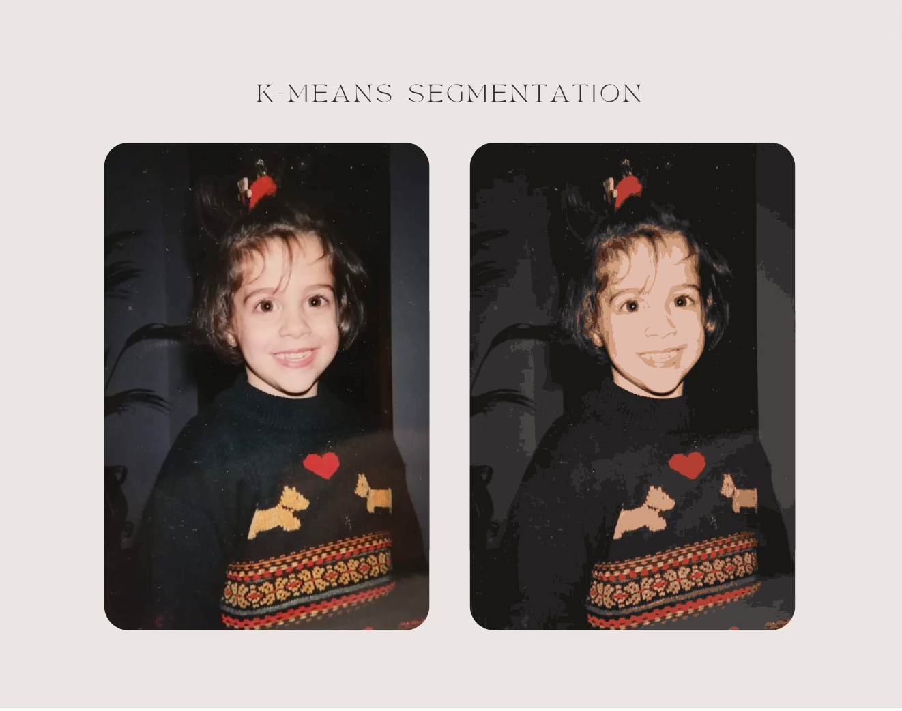

# K-Means Image Segmentation

This project provides an implementation of the k-means algorithm for image segmentation, inspired by the desire to reproduce similar images to some artists like Joan Aguiló, who uses color segmentation and reduction techniques to create bold murals.


The k-means algorithm is a clustering method that partitions a set of data points into k clusters based on their distance to the centroids. In the context of image segmentation, this means that the algorithm assigns each pixel to the cluster whose centroid is closest to it in color space. With this tool the user can choose the number of clusters allowing for flexibility and customization.



## Installation

To use this tool, you will need to have Python 3 installed on your system. You can download the latest version of Python from the official website: https://www.python.org/downloads/

Once you have Python installed, you can clone this repository to your local machine:

```bash
git clone https://github.com/ainanicolau/kmeans_image_segmentation.git
```
Next, navigate to the project directory and install the required dependencies using pip:

```bash
cd kmeans_image_segmentation
pip3 install -r requirements.txt
```

## Usage

#### Command-line Interface
To use the command-line interface, run:

```
python3 run_kmeans.py --k <number_of_clusters> --im <path_to_image_file>
```

#### Web Interface
To use the web interface, run:

```
python3 run_server.py
```
and navigate to http://localhost:8080 in your web browser.

